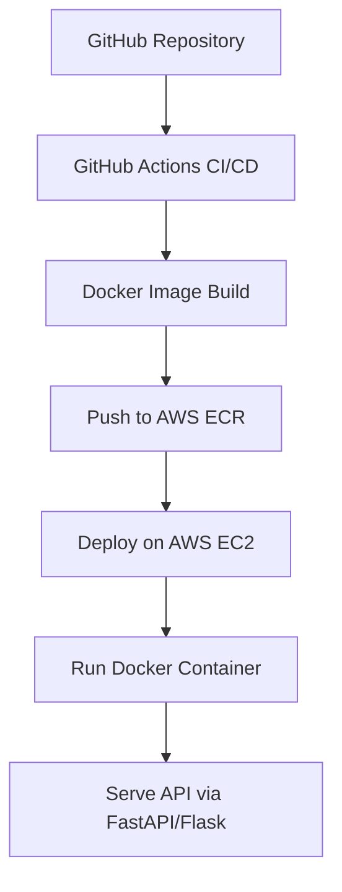

---

# 🚗 Vehicle Insurance Prediction MLOps Pipeline

An end-to-end Machine Learning Operations (MLOps) project that predicts whether a customer will opt for vehicle insurance. This system integrates data ingestion, preprocessing, model training, evaluation, and deployment using modern MLOps tools and practices.

---

## 📌 Table of Contents

* [📌 Table of Contents](#-table-of-contents)
* [🎯 Project Overview](#-project-overview)
* [🛠️ Tech Stack](#️-tech-stack)
* [📈 ML Pipeline Architecture](#-ml-pipeline-architecture)
* [🚀 Deployment Architecture](#-deployment-architecture)
* [🧪 Model Evaluation](#-model-evaluation)
* [📂 Project Structure](#-project-structure)
* [⚙️ Setup Instructions](#️-setup-instructions)
* [📬 Contact](#-contact)

---

## 🎯 Project Overview

This project aims to build a scalable and automated pipeline that predicts the likelihood of a customer purchasing vehicle insurance. It encompasses the full spectrum of MLOps, from data ingestion to model deployment, ensuring a seamless transition from development to production.

---

## 🛠️ Tech Stack

**Programming & Frameworks:**

* Python 3.11
* FastAPI
* Flask
* Scikit-learn
* Pandas, NumPy

**MLOps & DevOps Tools:**

* Docker
* Terraform
* Ansible
* GitHub Actions (Self-hosted runners)
* AWS (EC2, S3, ECR, IAM)

**Data Handling:**

* MongoDB
* SMOTEENN (for class imbalance)
* StandardScaler, MinMaxScaler

---

## 📈 ML Pipeline Architecture


**Pipeline Components:**

1. **Data Ingestion:** Extracts data from MongoDB.
2. **Data Validation:** Ensures schema consistency and data quality.
3. **Data Transformation:** Applies preprocessing steps like encoding, scaling, and balancing.
4. **Model Training:** Trains models (Logistic Regression, Random Forest) on processed data.
5. **Model Evaluation:** Assesses model performance using metrics like accuracy, precision, recall, and F1-score.
6. **Model Pusher:** Uploads the best-performing model to AWS S3.
7. **Deployment:** EC2 instance retrieves the model from S3 and serves it via FastAPI/Flask.

---

## 🚀 Deployment Architecture



**Deployment Highlights:**

* **CI/CD:** Automated using GitHub Actions with self-hosted runners on EC2.
* **Infrastructure as Code:** Managed using Terraform for AWS resources and Ansible for configuration management.
* **Containerization:** Application is containerized using Docker and stored in AWS ECR.
* **Deployment:** Docker containers are deployed on AWS EC2 instances, ensuring scalability and reliability.

---

## 🧪 Model Evaluation

| Metric    | Random Forest |
| --------- | ------------- |
| Accuracy  | 0.89          |
| Precision | 0.88          |
| Recall    | 0.86          |
| F1-Score  | 0.87          |

*Note: These metrics are based on the test dataset and may vary with different data splits.*

---

## 📂 Project Structure

```
├── .github/workflows/             # CI/CD pipelines (GitHub Actions)
│   └── CI-CD.yaml
├── Config/                        # Configuration templates (Model, Schema)
│   ├── Model.yaml
│   └── Schema.yaml
├── ansible-automation/           # Ansible playbooks for EC2 runner setup
│   ├── Clean-Ec2-Space.yaml
│   ├── Restart-runner.yaml
│   └── deploy_EC2.yaml
├── infrastructure/               # Terraform IaC for AWS
│   ├── backend-setup/
│   ├── infra-live/
│   └── modules/
├── src/                          # Core ML application code
│   ├── Cloud_Storage/            # AWS S3 interaction utils
│   ├── Components/               # Pipeline stages (Ingestion, Transformation, etc.)
│   ├── Configuration/            # Config management
│   ├── Constants/                # Global constants
│   ├── Data_Access/              # MongoDB interaction
│   ├── Entity/                   # Config/Data classes
│   ├── Exception/                # Custom exception handling
│   ├── Logger/                   # Logging setup
│   ├── Pipeline/                 # ML pipeline stages
│   ├── Utils/                    # Helper utilities
│   └── __init__.py
├── static/                       # Static assets (CSS, JS)
│   └── css.html
├── templates/                    # HTML templates
│   └── vehicledata.html
├── Dockerfile                    # Multi-stage Docker setup
├── LICENSE
├── README.md
├── app.py                        # Flask-based frontend
├── demo.py                       # FastAPI demo app (for prediction)
├── projectflow.txt               # High-level notes or flow
├── pyproject.toml
├── requirements.txt              # Python dependencies
├── setup.py
├── template.py
└── .project-root, .dockerignore, .gitignore

```

---

## ⚙️ Setup Instructions

**Prerequisites:**

* Python 3.11
* Docker
* AWS CLI configured
* Terraform
* Ansible

**Steps:**

1. **Clone the Repository:**

   ```bash
   git clone https://github.com/PrakashD2003/Vehicle-Insurance-Prediction-Mlops-Project.git
   cd Vehicle-Insurance-Prediction-Mlops-Project
   ```

2. **Create a Virtual Environment and Activate:**

   ```bash
   python3 -m venv venv
   source venv/bin/activate
   ```

3. **Install Dependencies:**

   ```bash
   pip install -r requirements.txt
   ```

4. **Run the Application:**

   ```bash
   python app/main.py
   ```

5. **Docker Deployment:**

   ```bash
   docker build -t vehicle-insurance-app .
   docker run -p 5000:5000 vehicle-insurance-app
   ```
   *have to add env variables

6. **Terraform Deployment:**

   ```bash
   cd infrastucture/infra-live
   terraform init
   terraform apply
   ```

7. **Ansible Configuration:**

   ```bash
   ansible-playbook -i inventory.ini ansible/playbook.yml
   ```

*Ensure AWS credentials are properly configured before running Terraform and Ansible scripts.*

---

## 📬 Contact

**Prakash D**

* **Email:** [prakash.dwivedi2003@gmail.com](mailto:prakash.dwivedi2003@gmail.com)
* **LinkedIn:** [www.linkedin.com/in/prakash-dwivedi-0b74b0352](https://www.linkedin.com/in/prakash-dwivedi-0b74b0352)
* **GitHub:** [github.com/PrakashD2003](https://github.com/PrakashD2003)

Feel free to reach out for collaborations, suggestions, or any queries related to this project.

---

